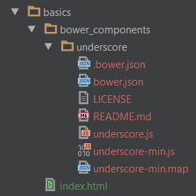

## Basics
As long as [Bower][] is a package manager, you should think that it lets install and uninstall packages very easily. And you are absolutely correct.

Let's take a look at most popular [Bower][] commands:

* [Install Package](#install-package)
* [Install Package with Specific Version](#install-package-with-specific-version)
* [Uninstall Package](#uninstall-package)

### Install Package
To add a new package to your project use `install` command followed by registered `<package name>`:
```bash
$ bower install <package name>
```

It's really so simple as it sounds. Let's install [Underscore.js][] library to our sample project:
```bash
$ bower install underscore
```

Installed package will be placed in a `bower_components` directory that is created in the folder which the [Bower][] command was executed. In our example as I run command inside `basics` folder it is created there:


---

You can change package destination folder using the configuration options, for more details read about [Advanced Bower Configuration][].

---

Once installed, we can use an [Underscore.js][] package in our sample project by simply adding a `<script>` tag to `index.html` file:
```html
<!DOCTYPE html>
<html lang="en">
<head>
    <meta charset="UTF-8">
    <title>Bower Basics</title>
</head>
<body>
    <h1>Bower Basics</h1>
    <script src="bower_components/underscore/underscore-min.js"></script>
</body>
</html>
```

As you can see it's really so simple.

### Install Package with Specific Version
You can probably ask which version does [Bower][] install using `install` command. And the answer will be the latest version among registered ones in its repository. If it's not what you wish, you can always point specific version during package installation. For this purpose follow `<package name>` by `#` and necessary `<version>` number:
```bash
$ bower install <package name>#<version>
```

Let's install [Velocity][] library version `1.2.3`:
```bash
$ bower install velocity#1.2.3
```

### Uninstall Package
To remove a package you can use `uninstall` command followed by the `<package name>` you wish to remove:
```bash
$ bower uninstall <package name>
```

Let's remove [Velocity][] library from our sample project:
```bash
$ bower uninstall velocity
```

As you can see [Bower][] removed `velocity` directory from `bower_components` folder:


---

Don't forget to remove `script` tag from `index.html` file. [Bower][] does not update any `html` files as it's only package manager.

---

You can also remove several packages at once, just type their names separated by space:
```bash
$ bower uninstall <package name 1> <package name 2>
```

---

Unfortunately, there is no option to install several packages at once by lising their names in `install` command. But you can achieve the same result using another technique, to learn it read about [Bower Configuration File][].

---

By this moment you have learned how to install and uninstall packages, but this is not the end of the world. Jump to the next topic to learn more commands to work with packages.

[Bower]: http://bower.io "Bower - Package Manager"
[Underscore.js]: http://underscorejs.org "Underscore - js library with useful helpers"
[Velocity]: http://julian.com/research/velocity "Velocity - accelerated js animation"
[Advanced Bower Configuration]: 02-Configuration.md
[Bower Configuration File]: 02-Configuration.md