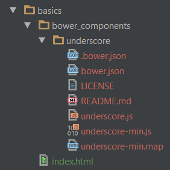

## Basics
As long as [Bower][] is a package manager, you should think that it works well with different third-party packages. And you are absolutely correct.

Let's take a look at basics [Bower][] commands.

### Install Package
To add a new package to your project use `install` command and known `package name`. It's really so simple as it sounds. Let's install [Underscore.js][] library to our sample project:
```bash
$ bower install underscore
```

Installed package will be placed in a `bower_components` directory that is created in the folder which the bower program was executed. In our example as I run command inside `basics` folder it's created there: 


---

You can change package installing destination using the configuration options, for more details read about [Bower Configuration][].

---

Once installed, we can use a [Underscore.js][] package in our sample project by simply adding a <script> or <link> tag to `index.html` file:\
```html
<!DOCTYPE html>
<html lang="en">
<head>
    <meta charset="UTF-8">
    <title>Bower Basics</title>
</head>
<body>
    <h1>Bower Basics</h1>
    <script src="bower_components/underscore/underscore-min.js"></script>
</body>
</html>
```

As you can see it's really simple.

You can probably ask which version does [Bower][] install using this command. The answer will be 
You can install a specific version of the package by adding a pound-sign (#) after the package name, followed by the version number.

bower install <package>#<version>


### Get Package State
### Update Package
### Uninstall Package
### Search Package


[Bower]: http://bower.io "Bower - Package Manager"
[Underscore.js]: http://underscorejs.org "Underscore - js library with useful helpers"
[Bower Configuration]: 02-Configuration.md